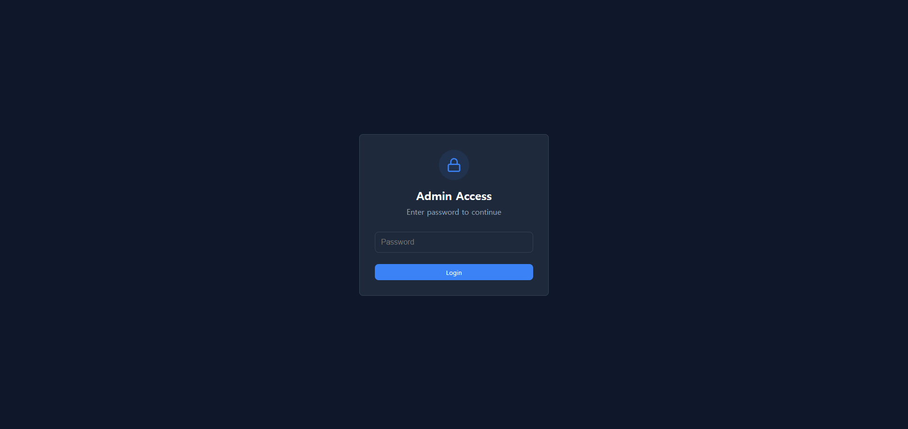
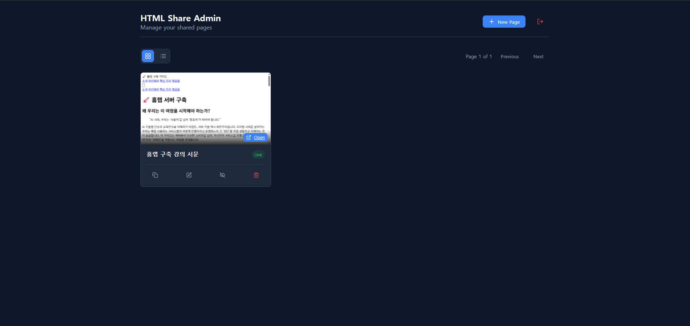
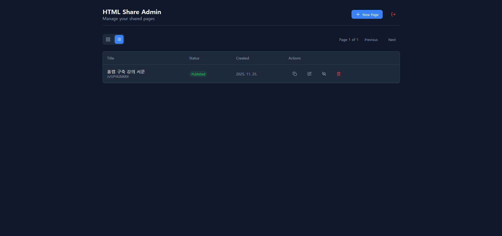
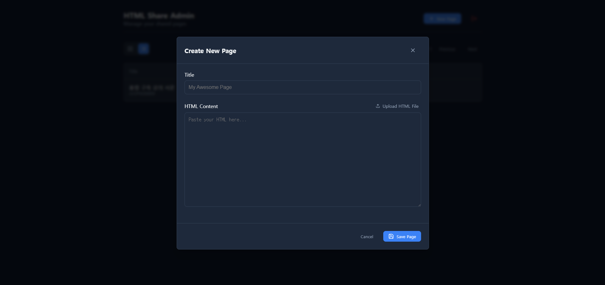

# HTML Share App

Gemini나 다른 LLM에서 생성된 HTML 콘텐츠를 쉽게 공유하기 위한 도커 기반의 프리미엄 웹 애플리케이션입니다.

## 주요 기능

- **간편한 공유**: HTML 코드를 붙여넣거나 파일을 업로드하여 공유 링크를 생성할 수 있습니다.
- **관리자 대시보드**: `/admin` 경로를 통해 안전하게 페이지를 관리할 수 있습니다.
- **다양한 보기 모드**: 타일 보기(미리보기 포함)와 리스트 보기를 지원합니다.
- **페이지 관리**: 페이지 생성, 수정, 삭제, 게시/비공개 전환이 가능합니다.
- **도커 지원**: Docker Compose를 사용하여 쉽게 배포할 수 있습니다.

## 기술 스택

- **Frontend**: React, Vite, Framer Motion (애니메이션), Lucide React (아이콘)
- **Backend**: Node.js, Express
- **Database**: PostgreSQL, Sequelize (ORM)
- **Infrastructure**: Docker, Docker Compose
- **Design**: Pure CSS (Custom Design System)

## 시작하기

### 필수 조건

- Docker 및 Docker Compose가 설치되어 있어야 합니다.

### Docker로 실행하기

1. 프로젝트 디렉토리로 이동합니다:
   ```bash
   cd html-share-app
   ```

2. 환경 설정 파일을 생성합니다:
   ```bash
   cp .env.sample .env
   ```

3. 서비스를 시작합니다:
   ```bash
   docker compose up --build
   ```

4. 애플리케이션 접속:
   - **관리자 패널**: [http://localhost:3001/admin](http://localhost:3001/admin)
   - **기본 비밀번호**: `admin123` (`.env` 파일에서 변경 가능)

### 로컬 개발 (Docker 없이 실행)

**주의**: 최신 Vite 버전을 사용하기 위해서는 **Node.js 18 이상** (권장 20 이상)이 필요합니다.

1. **서버 (Server)**:
   ```bash
   cd server
   npm install
   npm start
   ```

2. **클라이언트 (Client)**:
   ```bash
   cd client
   npm install
   npm run dev
   ```

## 환경 설정

프로젝트 루트의 `.env` 파일에서 환경 변수를 설정할 수 있습니다. `docker-compose.yml`은 이 파일의 값을 자동으로 로드합니다.

### 주요 환경 변수
- `APP_PORT`: 애플리케이션 포트 (기본값: 3001)
- `ADMIN_PASSWORD`: 관리자 패널 비밀번호
- `JWT_SECRET`: 세션 토큰을 위한 비밀 키
- `DB_HOST`, `DB_USER`, `DB_PASS`, `DB_NAME`: 데이터베이스 설정


## 문제 해결

### Node.js 버전 오류
Vite 최신 버전은 Node.js 18+ 또는 20+ 버전을 요구합니다. 만약 로컬에서 실행 시 버전 오류가 발생한다면 Node.js 버전을 업데이트해주세요.
Docker를 사용할 경우, 이미 호환되는 Node.js 버전(v20)이 설정되어 있어 별도의 설치가 필요 없습니다.

## 스크린샷

| 로그인 화면 | 대시보드 (타일 뷰) |
|:---:|:---:|
|  |  |

| 대시보드 (리스트 뷰) | HTML 작성 화면 |
|:---:|:---:|
|  |  |

## 라이센스

이 프로젝트는 MIT 라이센스 하에 배포됩니다. 자세한 내용은 `LICENSE` 파일을 참조하세요.

```text
MIT License

Copyright (c) 2025

Permission is hereby granted, free of charge, to any person obtaining a copy
of this software and associated documentation files (the "Software"), to deal
in the Software without restriction, including without limitation the rights
to use, copy, modify, merge, publish, distribute, sublicense, and/or sell
copies of the Software, and to permit persons to whom the Software is
furnished to do so, subject to the following conditions:

The above copyright notice and this permission notice shall be included in all
copies or substantial portions of the Software.

THE SOFTWARE IS PROVIDED "AS IS", WITHOUT WARRANTY OF ANY KIND, EXPRESS OR
IMPLIED, INCLUDING BUT NOT LIMITED TO THE WARRANTIES OF MERCHANTABILITY,
FITNESS FOR A PARTICULAR PURPOSE AND NONINFRINGEMENT. IN NO EVENT SHALL THE
AUTHORS OR COPYRIGHT HOLDERS BE LIABLE FOR ANY CLAIM, DAMAGES OR OTHER
LIABILITY, WHETHER IN AN ACTION OF CONTRACT, TORT OR OTHERWISE, ARISING FROM,
OUT OF OR IN CONNECTION WITH THE SOFTWARE OR THE USE OR OTHER DEALINGS IN THE
SOFTWARE.
```
